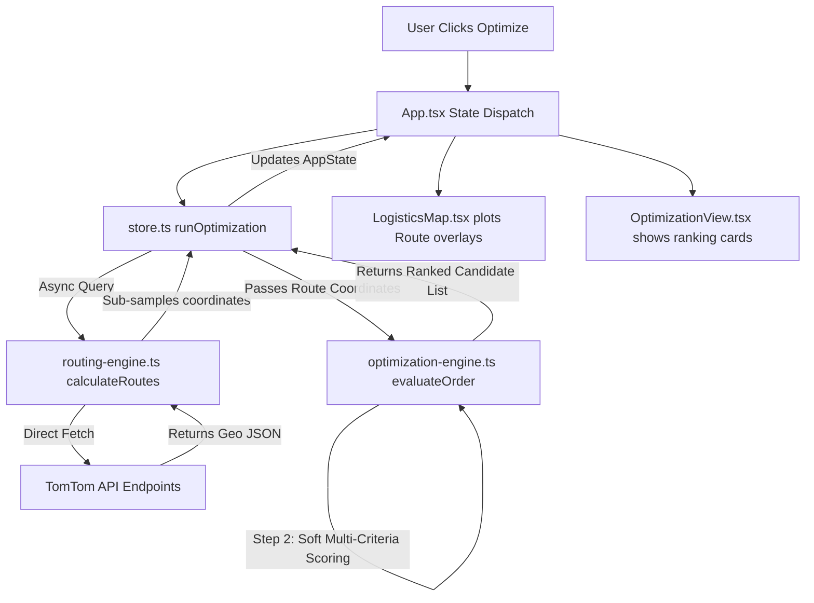

# LogiRoute OS - Technical Architecture Document

This document outlines the software design patterns, architectural layers, data flows, and component layouts that govern **LogiRoute OS**.

---

## 🎨 1. Core Architecture Patterns

LogiRoute OS follows a **Separated Concerns Architecture** utilizing three primary design patterns:
1. **Store Pattern (Single Source of Truth):** Global state is isolated inside a single class instance `LogisticsStore` ([`store.ts`](src/lib/store.ts)). React views only read state and invoke actions; they never manipulate data directly.
2. **Observer Pattern:** Components subscribe to state changes. When actions modify the store, `this.notify()` broadcasts updates to all listeners, triggering reactive UI re-renders.
3. **Layered Architecture:** The codebase is divided into distinct execution layers:
   * **View Layer:** Component tree (Navbar, Dashboard, Optimization comparative cards, Map).
   * **State Layer:** Class controller orchestrating simulations, triggers, and state queries.
   * **Engine Layer:** Deterministic mathematical computation scripts (`conflict-detector.ts`, `optimization-engine.ts`, `routing-engine.ts`).
   * **Mock Database / API Layer:** Express REST endpoints and baseline seed files.

---

## 🗺️ 2. Comprehensive Data Flow Diagram

---

## 📂 3. Component Details & Design Responsibilities

### A. State Manager (`src/lib/store.ts`)
* **State Interface (`AppState`):** Holds active collections of orders, vehicles, drivers, alerts, and analytics. Includes browser-wide `tomTomApiKey`.
* **Telemetry Ticker:** Runs a 1-second interval timer. In each tick, it advances simulated vehicle coordinates along active route polylines, decreases EV battery charge percentages, and calculates new ETAs.
* **API Key Manager:** Saves/loads developer credentials directly from the browser's `localStorage`.

### B. Routing Core (`src/lib/routing-engine.ts`)
* **Asynchronous Calculations:** Coordinates direct API HTTP `fetch` requests to TomTom. If a request fails or credentials are empty, it redirects seamlessly to `calculateRoutesSync` (generating curved mock coordinates).
* **Strategies Evaluation:** Queries Fastest routes (with traffic) for Express priority shipments, and queries Shortest/Eco routes for standard priority shipments.

### C. Optimization Heuristics (`src/lib/optimization-engine.ts`)
* **Hard Filters:** Enforces weight thresholds, vehicle-type cargo compliance, and EV range safety bounds.
* **Soft Scores:** Applies parametric weights representing travel times, warehouse proximity, cost factors, and electric vehicle preferences.

### D. Interactive Map View (`src/components/map/LogisticsMap.tsx`)
* Wrapper around the Leaflet GIS canvas.
* Draws custom map icons for vehicle starting depots, customer dropoffs, and en-route telemetry marker positions.
* Renders active path polylines, highlighting the recommended optimal path in solid blue, and alternative bypass options in dashed gray.

---

## 🔄 4. Real-time Simulation Lifecycles

### A. Congestion Incident Detouring Flow
1. Operator injects a traffic delay on a vehicle.
2. The simulation state raises a warning alert on the dashboard.
3. The store initiates an async reroute query from the vehicle's current transit coordinate index to the destination.
4. The TomTom API returns a traffic-avoidance bypass route.
5. The map updates the polyline path dynamically, recalculating and saving travel time.

### B. Fleet Swap Breakdown Flow
1. Operator injects a mechanical vehicle breakdown.
2. The simulation updates the vehicle to `maintenance` and halts movement.
3. The optimization engine searches for the nearest available backup vehicle with matching cargo capacity.
4. A new route is queried from the backup vehicle's starting point to the breakdown coordinate, and then to the customer.
5. The backup vehicle is assigned to the order on-screen and dispatched automatically.
