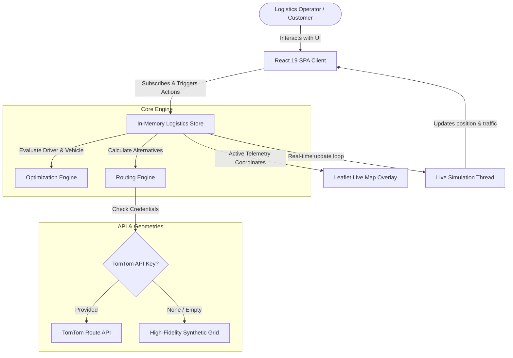
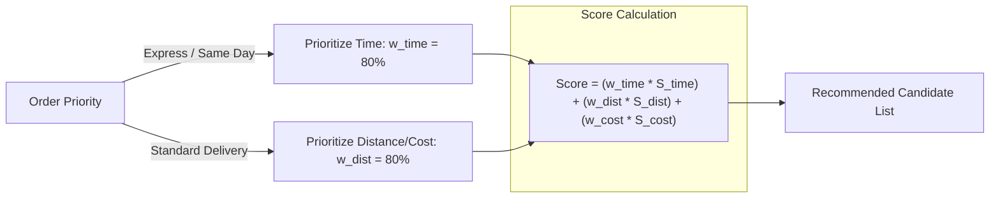

# LogiRoute OS 🚚💨
### Intelligent Route Optimization & Simulation Engine

[](https://team-04-bitkraft.vercel.app/)
[](https://dashboard.render.com/)
[](https://react.dev/)
[](https://developer.tomtom.com/)

LogiRoute OS is a next-generation real-time route optimization platform and simulation sandbox. Designed for modern logistics operators and dispatchers, it solves the "last-mile routing problem" dynamically by balancing **Travel Duration, Physical Distance, and Operational Costs** based on order priorities.

---

## 🗺️ 1. Architecture Flow & Visualizations

### 🖥️ High-Level System Architecture
The application runs as a unified monorepo. It features a React 19 Frontend communicating with an in-memory state engine, which connects to either the TomTom API or a high-fidelity local grid geometry fallback:



### 🧮 Multi-Criteria Score Calculation Flow
When optimization is requested for an order, the system scores every available driver-vehicle candidate based on the order's `DeliveryPriority`:



---

## 🎯 2. Evaluation & Judging Criteria Alignment

### 📋 Problem Understanding & Agent Scope
* **The Problem**: Dispatches are usually handled manually, leading to poor route choices, high carbon emissions, delayed ETAs, and high driver idle times.
* **Our Solution**: LogiRoute OS dynamically pairs pending orders with nearby active fleets using complex multi-criteria heuristics.
* **Agent Scope**: The Antigravity AI Agent is configured to assist in:
  1. Integrating third-party APIs (TomTom Route & Live Traffic APIs) asynchronously.
  2. Modifying scoring algorithms based on priorities.
  3. Organizing CSS layering (e.g. Leaflet map `z-0` vs modal dialog panels `z-[9999]`).
  4. Setting up robust, zero-downtime offline fallbacks.

### 🤖 Agent Specification Files & Configurations
To enable seamless development and let other developers or AI agents safely build on top of this engine, we have embedded custom agent guidelines inside the `.agents/` folder:
* [**`.agents/GEMINI.md`**](file:///.agents/GEMINI.md): Outlines coding guidelines, Tailwind rules, Leaflet overlay z-index restrictions, and TypeScript expectations.
* [**`.agents/skills/logiroute-engine/SKILL.md`**](file:///.agents/skills/logiroute-engine/SKILL.md): Details formula weights, TomTom coordinate sub-sampling logic, and how to verify mock engine fallbacks.

### 🔄 Prompting & Iteration Process
Development was performed iteratively, tracking bug fixes and enhancements step-by-step:
1. **API Integration Phase**: Connected TomTom API asynchronously. Designed persistent client storage for keys to prevent exposure in commits.
2. **UI & Layout Stabilization**: Fixed a rendering collision where Leaflet maps bled through interactive modals. Cleaned CSS using strict utility-first layouts.
3. **CommonJS & ESM Bundling Correction**: Resolved a critical bundler crash where `import.meta.url` was compiled to an unsupported output format under esbuild, resulting in a server launch failure on Render. Cleaned the code to rely on robust, safe path loaders.

### ⚡ Agent Behavior Limitations & Output Quality
* **State Persistence Limit**: All data is stateful in-memory. Container restarts or hard reloads reset the demo scenario back to default seeds.
* **API Rate Limits**: The TomTom routing engine sub-samples coordinate points. If the API key is absent, the system instantly switches to a high-fidelity synthetic city grid generator to ensure continuous runtime.
* **TypeScript Integrity**: Verified by running `npm run lint` (`tsc --noEmit`), exiting with status `0`.

---

## 🚀 3. Live Deployments

### ⚡ Frontend Static Deployment (Vercel)
* **Live Link**: [https://team-04-bitkraft.vercel.app/](https://team-04-bitkraft.vercel.app/)
* **Build Settings**: Vite application preset. Builds using `npm run build` and exports the static `dist/` directory.

### 🌐 Unified API Backend & Frontend Deployment (Render)
* **Build Command**: `npm install && npm run build`
* **Start Command**: `npm start` (Runs `node dist/server.cjs`)
* **Environment Variables**:
  * `NODE_ENV` = `production`
  * `TOMTOM_API_KEY` = `dV3Tq3qAYr9qOCtHUISX27pZgRZvW5gw` (Optional: configure on Render to sync backend computations)

---

## 🛠️ 4. Local Development & Demo Setup

### Installation
1. Clone the repository and navigate to the directory:
   ```bash
   git clone https://github.com/Sriyasnehasis/Team-04-BITKRAFT.git
   cd Team-04-BITKRAFT
   ```
2. Install dependencies:
   ```bash
   npm install
   ```
3. Run the development server (runs Express + Vite):
   ```bash
   npm run dev
   ```
4. Open your browser and navigate to `http://localhost:3000`.

### ⚙️ Demo Walkthrough
1. **Change User Roles**: Switch roles in the navigation bar to see the **Operator Dashboard** or the **Customer Portal**.
2. **Adjust Optimization Settings**: Click the ⚙️ gear icon in the navigation bar. Adjust the weights for Time, Distance, and Cost, then click save.
3. **Dispatch & Simulation**: Click on a pending order, run the optimization evaluation, select the top driver/vehicle candidate, and click **Assign & Simulate** to watch telemetry move live along the route corridors!
